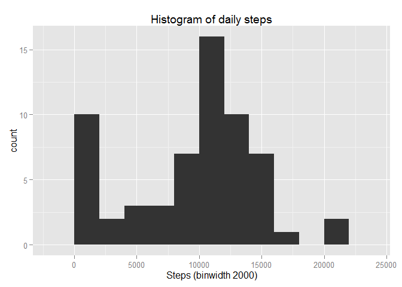

# Reproducible Research: Peer Assessment 1


## Loading and preprocessing the data
I clean the environment

```r
  rm(list=ls(all=TRUE))
```
Then, I load the csv file and inspect columns and data

```r
  # Load the data
  csvData = read.csv('activity.csv')
  # Get the names
  names(csvData)
```

```
## [1] "steps"    "date"     "interval"
```

```r
  # Display the internal structure
  str(csvData)
```

```
## 'data.frame':	17568 obs. of  3 variables:
##  $ steps   : int  NA NA NA NA NA NA NA NA NA NA ...
##  $ date    : Factor w/ 61 levels "2012-10-01","2012-10-02",..: 1 1 1 1 1 1 1 1 1 1 ...
##  $ interval: int  0 5 10 15 20 25 30 35 40 45 ...
```

```r
  # Get the first 6 observations
  head(csvData)
```

```
##   steps       date interval
## 1    NA 2012-10-01        0
## 2    NA 2012-10-01        5
## 3    NA 2012-10-01       10
## 4    NA 2012-10-01       15
## 5    NA 2012-10-01       20
## 6    NA 2012-10-01       25
```
Finally, I process data into a format suitable

```r
  csvData$date <- as.Date(csvData$date)
```

## What is mean total number of steps taken per day?

```r
  #histogram of the total number of steps taken each day
  library(ggplot2)
```

```
## Warning: package 'ggplot2' was built under R version 3.2.1
```

```r
  total.steps.by.day <- aggregate(x = csvData$steps , by = list(csvData$date), FUN = sum ,na.rm=TRUE)
  names(total.steps.by.day) <- c("date","steps")
  histplot <- ggplot(total.steps.by.day,aes(x = steps)) +
              ggtitle("Histogram of daily steps") +
              xlab("Steps (binwidth 2000)") +
              geom_histogram(binwidth = 2000)
  histplot
```

 

```r
  #mean total number of steps taken per day
  mean(total.steps.by.day$steps , na.rm = TRUE)
```

```
## [1] 9354.23
```

```r
  #median total number of steps taken per day
  median(total.steps.by.day$steps , na.rm = TRUE)
```

```
## [1] 10395
```
## What is the average daily activity pattern?

```r
  #Time series plot of 5-minute interval and the average number of steps taken,   averaged across all days
  average.steps.by.interval  <- aggregate(x = csvData$steps , by = list(csvData$interval), FUN = mean ,na.rm=TRUE)
  names(average.steps.by.interval) <- c("interval","steps")

  avg.step.line <- ggplot(average.steps.by.interval,aes(interval,steps)) +
                 ggtitle("Time Series Plot of Average Steps by Interval") +
                 geom_line()
  avg.step.line  
```

 

```r
  #The 5-min time interval contains the maximum number of steps?
  average.steps.by.interval[which.max(average.steps.by.interval$steps),c("interval")]
```

```
## [1] 835
```
## Imputing missing values

```r
  #total number of missing values in the dataset
  nrow(csvData[is.na(csvData$steps),])
```

```
## [1] 2304
```

```r
  #imputing missing step values with mean step at time interval
  csvData.imputed <- merge(x = csvData, y = average.steps.by.interval, by = "interval", all.x = TRUE)
  csvData.imputed[is.na(csvData.imputed$steps.x),c("steps.x")] <- csvData.imputed[is.na(csvData.imputed$steps.x),c("steps.y")]

  #cleaning data
  csvData.imputed$date <- as.Date(csvData.imputed$date)
  csvData.imputed$date.x <- NULL
  csvData.imputed$Group.1 <- NULL
  csvData.imputed$steps <- csvData.imputed$steps.x
  csvData.imputed$steps.x <- NULL
  csvData.imputed$steps.y <- NULL

  #histogram with new dataframe
  total.steps.by.day <- aggregate(x = csvData.imputed$steps , by = list(csvData.imputed$date), FUN = sum ,na.rm=TRUE)
  names(total.steps.by.day) <- c("date","steps")
  histplot <- ggplot(total.steps.by.day,aes(x = steps)) +
            ggtitle("Histogram of daily steps after imputation") +
            xlab("Steps (binwidth 2000)") +
            geom_histogram(binwidth = 2000)
  histplot 
```

 

```r
  #mean total number of steps taken per day
  mean(total.steps.by.day$steps , na.rm = TRUE)
```

```
## [1] 10766.19
```

```r
  #median total number of steps taken per day
  median(total.steps.by.day$steps , na.rm = TRUE)
```

```
## [1] 10766.19
```
## Are there differences in activity patterns between weekdays and weekends?

```r
  #Factor variable with two levels indicating a weekday or weekend.
  csvData.imputed$weekday <- as.factor(ifelse(weekdays(csvData.imputed$date) %in% c("Saturday","Sunday"), "Weekend", "Weekday")) 

  average.steps.by.interval.and.weekday  <- aggregate(x = csvData.imputed$steps, by = list(csvData.imputed$interval,csvData.imputed$weekday), FUN = mean ,na.rm=TRUE)
  names(average.steps.by.interval.and.weekday) <- c("interval","weekday","steps")

  #panel time series plot of the 5-minute interval and the average number of steps taken 
  #averaged across all weekday days or weekend days.
  avg.step.line <- ggplot(average.steps.by.interval.and.weekday,aes(interval,steps)) + ggtitle("Time Series Plot of Average Steps by Interval after Imputation") + facet_grid(. ~ weekday) + geom_line(size = 1)
  avg.step.line  
```

 
